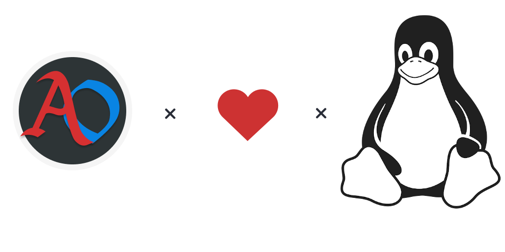

## Contenido

+ [Requisitos](#Requisitos)
+ [Instrucciones](#Instrucciones)
+ [Post-instalación](#Post-instalación)
+ [Actualización del cliente](#Actualización-del-cliente)
+ [Inspección](#Inspección)
+ [Consideraciones](#Consideraciones)
+ [Aclaraciones](#Aclaraciones)

### Requisitos

+ _Ubuntu_ (20.04, 18.04 o 16.04) o _Manjaro_
+ `curl` o `wget`
+ `git`

### Instrucciones

#### Con `curl`

```shell
sh -c "$(curl -fsSL https://raw.githubusercontent.com/RenxoAr/ao-libre-linux/master/install.sh)"
```

#### Con `wget`

```shell
sh -c "$(wget -O - https://raw.githubusercontent.com/RenxoAr/ao-libre-linux/master/install.sh)"
```

#### Manual

```shell
git clone https://github.com/RenxoAr/ao-libre-linux.git ~/.ao-libre-linux
sh ~/.ao-libre-linux/install.sh
```

### Post-instalación

Si se desea correr Argentum Online Libre en cualquier momento luego de la instalación puede hacerse de esta manera:

```shell
sh ~/.ao-libre-linux/run.sh
```

### Actualización del cliente

El cliente va a actualizar automáticamente a la versión correspondiente al ejecutarse con el script `run.sh`

### Inspección

Es aconsejable inspeccionar los scripts de fuentes que uno desconoce antes de ejecutarlos.
Pueden verificarlos de la siguiente manera:

```shell
curl -Ls https://raw.githubusercontent.com/RenxoAr/ao-libre-linux/master/install.sh | less
curl -Ls https://raw.githubusercontent.com/RenxoAr/ao-libre-linux/master/dependencies.sh | less
curl -Ls https://raw.githubusercontent.com/RenxoAr/ao-libre-linux/master/run.sh | less
curl -Ls https://raw.githubusercontent.com/RenxoAr/ao-libre-linux/master/wine-config.sh | less
curl -Ls https://raw.githubusercontent.com/RenxoAr/ao-libre-linux/master/cliente-installer.sh | less
```

### Consideraciones

Los scripts van a instalar todas las dependencias, el launcher y el cliente de _AO Libre_.
Al preguntar por la instalación de `Mono` y `Gecko` aceptar (es necesario para ejecutar el cliente).
Una vez finalizada la instalación se inicia el cliente.

Todo el contenido del repositorio que se descarga se encuentra en: `~/.ao-libre-linux` por defecto si se ejecuta como lo indicado en [Instrucciones](#Instrucciones).

Para purgar la instalación (luego de desinstalar) de Argentum Online Libre: `rm -rf ~/.wine/wineprefix/Argentum`

Launcher:

+ Elegir idioma y continuar con la instalación
+ Mantener la ruta por defecto de instalación del cliente
+ Desmarcar *Ejecutar* y *Ver Leeme* al finalizar la instalación (no funciona)
  
### Aclaraciones

**Para distribuciones basadas en Debian:**
Si devuelve un error de _SECUR32_ reinstalar el paquete `winbind`:

```shell
sudo apt install --reinstall winbind
```

Si se necesita instalar o reinstalar alguna dependencia, posteriormente a la instalción de `wine`, [reinstalarlo](#Manual) para el correcto funcionamiento (utilizar `install.sh`).

**Nota:**
Para testing en otras distribiciones, además de las listadas en `packages.lst` y `packages-arch.lst` (en su mayoría librerías 32bits),
se tienen que tener en cuenta las siguientes dependencias:

+ `winehq-stable`
+ `wine-stable`
+ `wine-stable-amd64`
+ `wine-stable-i386`
+ `gecko`
+ `mono`

La configuración de _WINE_, la instalación del cliente y su configuración son distro-agnósticas.
Lo único que requiere modificación son las dependencias.

### TODO

+ [ ] Testear otras distros
+ [ ] Testear VMs
+ [ ] Testear LiveUSB
+ [ ] Reemplazar repositorio de WINE por repositorios oficiales
+ [ ] Generar Desktop File
+ [ ] Reducir el User Input al mínimo posible
+ [ ] Reducir las descargas de dependencias al mínimo posible
+ [ ] Reducir la cantidad de dependencias al mínimo indispensable
+ [ ] Generalizar dependencias
+ [ ] Portear a distribuciones padre de las ya comprobadas (Arch Linux y Debian)
+ [ ] Reemplazar winetricks por winecfg
+ [ ] Generar output para interfaz amigable :slightly_smiling_face:

---

Dedicado a toda la comunidad de Argentum Online.
